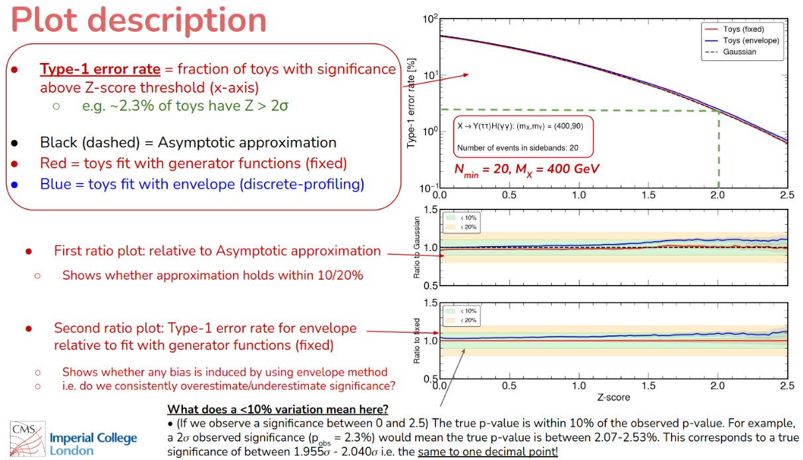

# Bias in significance

Here we provide a script to perform the bias studies developed for the HIG-22-012 analysis.

For extremely low stat categories the nominal bias studies can fail as the fitted PDF goes negative for a large fraction of the toys, unless we truncate r at 0 which then means we get a truncated pull distribution.

For HIG-22-012 we developed a method which looks at the **bias in significance**. In short, the method uses the significance as a metric, and compares the Type-1 error rate (fraction of toys with significance greater than some threshold) for fixed (best-fit) and floating PDF indices, where the toys are generated with the best-fit index. If the curves differ significantly between these two choices then it indicates some bias in the method. The plot also compares the Type-1 error rate to the asymptotic approximation curve, indicating whether the analysis will need to use the `HybridNew` method in the limit setting. More information is provided in `AN2022_074_v7` (section 9.5), which is attached to the HIG-22-012 CADI. 

A description of what the plots show is provided in the following slide:


## Inputs
You can run the study for the full workspace or for each category individually.
To prepare individual category workspaces you can use the existing combineCards functionality, for example:
```
combineCards.py Datacard.txt --ic cat_name > Datacard_cat_name.txt
```

This creates a .txt datacard with only categories matching the reg exp `cat_name` included. 
Be careful: you will probably have to manually delete some pdfindex lines at the bottom; 
the script does not know that these correspond to the analysis categories, 
and therefore will leave them all in (you only want the one corresponding to the category you are studying). 

Once that is done, you can run your usual `text2workspace` command to generate the `-d, --datacard` input for this script. 

For the full workspace, just use the compiled datacard with all categories as input.

## Usage

The script is split into four different stages. You can configure the number of toys with the `--nToys` option. If the run-time is too long you could consider creating a stat-only workspace e.g. remove all systematics (not including the PDF indices) from the txt datacard and recompile. The bias studies are probably fine to do stat-only (for stat dominated analyses). If still too long then you will want to parallelize into separate jobs and hadd the fit results at the end. An example on how to do this for the SGE batch submission system is provided in the `RunBiasInSignificance_hig22012.py` script.

### Setup
Do an initial fit to the workspace, fixing the signal strength (r) to zero. Save the values of the best-fit pdf indices. Combine requires at least one parameter to fit which you can define with the `--initial-fit-param` option. You can set this to any parameter in the workspace (ideally a nuisance a low impact). The default is a parameter named `lumi_13TeV_uncorrelated_2016`.
```
python RunBiasInSignificance.py --inputWSFile Datacard.root --MH 125.38 --mode setup
```

### Generate toys
```
python RunBiasInSignificance.py --inputWSFile Datacard.root --MH 125.38 --nToys N --mode generate
```
### Fit with the PDF indices fixed
Extract significance for each toy, where the PDF is fixed to the generator PDF (best-fit from setup step).
```
python RunBiasInSignificance.py --inputWSFile Datacard.root --MH 125.38 --nToys N --mode fixed
```

### Fit with the PDF indices floating
Extract significance for each toy, where the PDF index if floating
```
python RunBiasInSignificance.py --inputWSFile Datacard.root --MH 125.38 --nToys N --mode envelope
```

## Plotting the bias in significance results
```
python SummaryBiasSignificance.py
```
